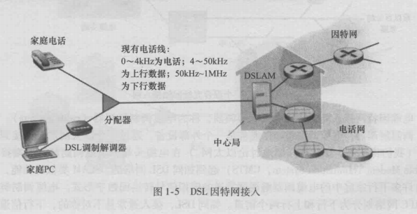
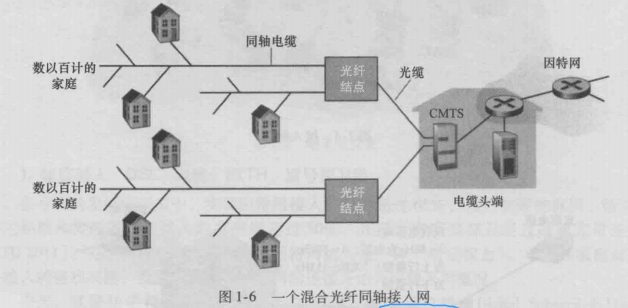
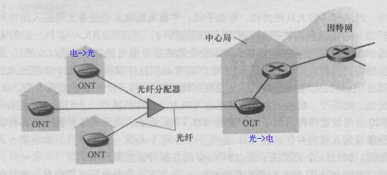

[toc]

# 综述
出现的名词：
```
主机，客户，服务器，数据中心
接入网，边缘路由器
```

网络边缘主要考察什么？常用设备，端系统。
端系统也称为主机，因为他们运行应用程序。
主机可以再划分为: **客户**(client)和 **服务器**(server)
  - 可以把客户理解为桌面PC，移动PC和智能手机登
  - 服务器比较好理解，机房

## 接入网(access network)
接入网指的是将端系统连接到其 **边缘路由器**(edge router)的物理链路。
边缘路由器指的是端系统到任何其他远程端系统的路径上的第一台路由器。
  - 以自己家为例，破废的电脑是端系统，家里的路由器即边缘路由器，路由器到电脑的网线即为接入网。

### 1：家庭接入
```
DSL、电缆、FTTH、拨号、卫星
```
宽带住宅的两种流行的类型：
  - 1：数字用户线(Digital Subscriber Line)DSL；
    当使用DSL时，用户的本地电话公司也是它的ISP。如下图所示，每个住户的 **DSL调制解调器** 使用现有的电话线与位于本地电话公司的本地中心局(CO)中的数字用户线接入复用器(DSLAM)来交换数据。
    家庭的DSL调制解调器得到数字数据后将其转换为高频音，以通过电话线传输给CO；一个分频器把到达家庭的数据信号和电话信号分开，将数字信号转发给DSL调制解调器。
    来自很多住户的模拟信号在DSLAM处被转换回数字形式；在CO中，DSLAM把数据和电话信号分割开，将数据送往因特网。

    

    还有一点是下行和上行
  - 2：电缆因特网接入(cable Internet access)
    **混合光纤同轴**(Hybrid Fiber Coax HFC)：如下图：同时使用了同轴电缆和光纤

      

    **电缆调制解调器**(cable modem)，如同DSL调制解调器。
    在电缆头端， **电缆调制解调器端接系统**(Cable Modem Termination System CMTS)起到如同DSL网络的DSLAM类似的功能，即将来自许多佳通中的电缆调制解调器发送的模拟信号转换回数字形式。

    此处也有上行和下行的概念。

**光纤到户**(Fiber To The Home FTTH)
  - 1：**主动光纤网络**(Active Optical Network)
  - 2：**被动光纤网络**(Passive Optical Network)

    

    **管线网络端接器**(Optical Network Terminator)ONT 存放于住户家中，用户将无线路由器与ONT相连，经过路由器接入因特网，ONT由光纤连接到近点的 **分配器**(splitter)
    分配器集中一些家庭，并连接到中心局中的 **光纤线路端接器** (Optical Line Terminator OLT)。
    OLT提供光信号和电信号的转换，再经过本地电话公司的路由器与因特网相连。

### 企业接入：以太网和WIFI
局域网(LAN)将端用户连接到边缘路由器。
在无限LAN环境中，无线用户从/到一个接入点发送/接收分组，该接入点与企业网连接，企业网再与有限因特网相连。

## 物理媒体
  - 1:导引型媒体 (guided media)
    电波沿着固体媒体前进，如：光缆、双绞铜线或同轴电缆
  - 2:非引导性媒体(unguided media)
    电波在空气或外层空间中传播，无线局域网

**双绞铜线**：
**同轴电缆**：
**光纤**：
**陆地无线电信道**：
**卫星无线电信道**：
