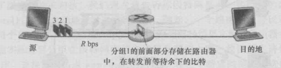

[toc]

网络核心：由互联因特网端系统的分组交换机和链路构成的网状网络。

通过网络链路和交换机移动数据有两种基本方法：**电路交换**(circut switching) 和 **分组交换**(packet switching)

## 分组交换
端系统彼此交换 **报文**(message)。报文包含协议设计者需要的东西。
为了从源端系统向目的端系统发送一个报文，源将长报文划分为较小的数据块，称之为 **分组**(packet)。
  - 分组以等于该链路最大传输速率的速度传输通过通信链路(是不是说分组能够以最大的速率在通信链路上传输？)
    如果某源端系统或分组交换机经过一条链路发送一个L比特的分组，链路的传输速率为R比特/秒。则传输该分组的时间为L/R秒

在源和目的之间，每个分组都通过通信链路和 **分组交换机**(packet switch)
  - 交换机有 **路由器** 和 **链路层交换机**
### 1：存储转发传输
多数分组交换机在链路的输入端使用 **存储转发传输**(store-and-forward transmission)机制。
  - 存储转发机制是指在交换机能够开始向输出链路传输该分组的第一个比特之前，必须接收到整个分组。

    

  上图中的路由器目的是：将分组从输入链路转移到另一条唯一的连接链路。
  打个比方，在某个时刻，源传输了分组1的部分内容，分组1的前沿已经到达了路由器，也就是只有一部分到达了分组交换器。
  因为该路由器使用的是存储转发机制，所以此时还不能传输已经接收的比特，必须先缓存(存储)分组1的所有比特。接收完了分组1的内容才能开始传输。

现在考虑一下时延问题：
  如果说此时在端到目的之间有N条速率为R的链路组成的路径(也就是源于目的地之间有N-1台路由器)，容易计算得端到目的地的时延为：
      d = N * (L/R)

### 2：排队时延和分组丢失
分组交换机都是与多条链路连一起的。
对于每条相连的链路，分组交换机具有一个 **输出缓存**(output buffer)或 **输出队列**(output queue)
  - 主要用于存储路由器准备发往哪条链路的分组
紧接着引入 **排队时延**(queue delay)
  - 因为到达分组交换机中的分组需要传输到某个链路，但是该链路可能正在传输其他的分组，所以说到达的分组需要在该输出缓存中进行等待，也就导致分组还需要考虑缓存的 **排队时延**。有别于上面讨论的 **存储转发时延**
既然队都排了，队不可能无限长，所以还会出现 **分组丢失(丢包)**(packer lost)的情况
  - 即到达的分组或已经排队的分组被丢弃了，主要的原因是缓存空间的大小是有限的，也就存在刚到达的分组面临着该缓存已经被其他等待传输的分组占满的情况。

上面讨论的这几个概念可以类比到日常生活中：比如去喝奶茶，人少的时候一个一个去，当然不用排队，突然这个店成网红点了，人多了，排了好长的对，排队的时间可以理解为 **排队时延** ，排队期间我可能不买了，走了，也就出现了 **分组丢失** 的情况。

### 3：转发表和路由选择协议
前面一直讨论的情况有一个前提是分组交换机可以将分组转发给输出的链路。但是分组交换机是怎么决定将分组转发给哪条链路呢？
  - 使用IP地址，每一个端系统都有自己的IP地址。
  - 当一个分组到达网络中的路由器的时候，路由器检查该分组的目的地址的，并用此地址搜索其转发表，发现合适的输出链路，向一台相邻的路由器转发该分组。
  - 每一台路由器都有一个 **转发表**(forwarding table)，用于将目的地址(或目的地址的一部分)映射成为输出链路。

举个栗子：就像我现在开车随机去一个地点，但是不使用导航，整个过程必须问路。那么我所问路的人会指引我到达最后的目的地。

但是还有一个问题：转发表怎么设置的？人工？自动？
  - **路由选择协议**（routing protocal）

## 电路交换
在电路交换网络中，在端系统之间通信会话的期间，预留了端系统之间通信沿路径所需要的资源(缓存，链路传播速率)
  - 可以理解为：两个端系统进行通信，只要链接建立了，在还没有完全结束之前，所有保证链接的资源都得保存好，即使两者暂时不发送数据。
  - 对比于分组交换网络，上述的所谓的资源是不会保存的，是按需分配，但是也就面临了排队等待的情况。

### 1：电路交换网络中的复用（不是很懂）
链路中的电路是通过 **频分复用**(Frequency-Division Multiplexing , FDM)或 **时分复用**(Time-Division Multiplexing,TDM)来实现的。
  - FDM：链路中的频谱由跨越链路创建的所有连接所共享(?????????)
    - 在连接期间链路为每条连接专用一个频段
    - 在电话网络中，这个频段通常具有4kHz的宽度，频段的宽度称之为 **带宽**(bandwidth)
  举个栗子：广播电台
  - TDM(?????什么意思嘛)：时间被划分为固定区间的帧，并且每帧又被划分为固定数量的时隙。
    - 当网络跨越一条链路创建一条连接时，网络在每个帧中为该连接指定一个时隙，这个时隙专门由该连接单独使用
    - 一个时隙(在每个帧内)可用于传输该连接的数据
    - 一条电路的传输速率等于帧速率乘以一个时隙内的比特数量

### 2：分组交换与电路交换对比
#### 电路交换
由于电路交换在通信之前要在通信双方之间建立一条被双方独占的物理通路（由通信双方之间的交换设备和链路逐段连接而成）。因而有以下优缺点。
**优点**：
  - 由于通信线路为通信双方用户专用，数据直达，所以传输数据的 **时延非常小**。
  - 通信双方之间的物理通路一旦建立，双方可以随时通信，**实时性强**。
  - 双方通信时按发送顺序传送数据，**不存在失序问题**。
  - 电路交换既适用于 **传输模拟信号**，也适用于 **传输数字信号**。
  - 电路交换 **设备控制均较简单**。
**缺点**：
  - 电路交换的平均连接 **建立时间** 对计算机通信来说偏长。
  - 电路交换连接建立后，物理通路被通信双方独占，即使通信线路空闲，也不能供其他用户使用，因而 **信道利用低**。
  - 电路交换时，数据直达，不同类型、不同规格、不同速率的终端很难相互进行通信，也难以在通信过程中进行差错控制。

#### 分组交换
分组交换采用存储转发传输方式，将一个长报文先分割为若干个较短的分组，然后把这些分组（携带源、目的地址和编号信息）逐个地发送出去，因此分组交换除了具有报文的优点外，与报文交换相比有以下优缺点：

**优点**：
  - 加速了数据在网络中的传输。因为分组是逐个传输，可以使后一个分组的存储操作与前一个分组的转发操作并行，这种流水线式传输方式减少了报文的传输时间。此外，传输一个分组所需的缓冲区比传输一份报文所需的缓冲区小得多，这样因缓冲区不足而等待发送的机率及等待的时间也必然少得多。
  - 简化了存储管理。因为分组的长度固定，相应的缓冲区的大小也固定，在交换结点中存储器的管理通常被简化为对缓冲区的管理，相对比较容易。
  - 减少了出错机率和重发数据量。因为分组较短，其出错机率必然减少，每次重发的数据量也就大大减少，这样不仅提高了可靠性，也减少了传输时延。
  - 由于分组短小，更适用于采用优先级策略，便于及时传送一些紧急数据，因此对于计算机之间的突发式的数据通信，分组交换显然更为合适些。
**缺点**：
  - 尽管分组交换比报文交换的传输时延少，但仍存在存储转发时延，而且其结点交换机必须具有更强的处理能力。
  - 分组交换中的每个分组都要加上源、目的地址和分组编号等信息，这将增大传送的信息量，一定程度上降低了通信效率，增加了处理的时间，使控制复杂，时延增加。
  - 当分组交换采用数据报服务时，可能出现失序、丢失或重复分组，分组到达目的结点时，要对分组按编号进行排序等工作，增加了麻烦。若采用虚电路服务，虽无失序问题，但有呼叫建立、数据传输和虚电路释放三个过程。

总之，若传输的数据量很大，而且传送时间远大于呼叫时间，则采用电路交换较为合适；
当端到端的通路由很多段的链路组成时，采用分组交换较为合适。
从提高整个网络的信道利用率上看，分组交换优于电路交换。

## 网络中的网络
网络结构复杂
