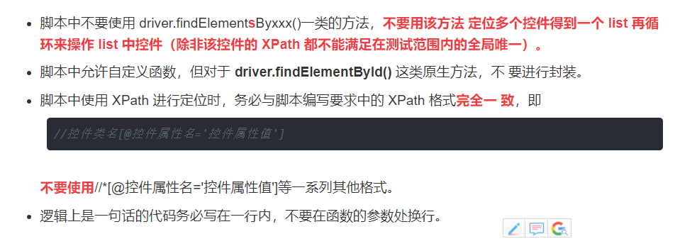

#### 环境

#### 定位组件 - 

主要是判断APK的层级关系，各个组件的id

方便使用ID定位组件，方便使用Xpath定位组件

https://blog.csdn.net/qq_17497931/article/details/102814675

定位控件的参数选择要求

原则：对脚本控件定位参数的选择要追求在要求范围内的唯一性。

即除了在多个页面中都会出现的公共控件之外（例如返回按钮），其它的控 件定位参数的选择要做到在题目范围内的全局唯一

**优先使用控件的 id 来定位控件（对应 driver.findElementById()方法），若 id 在题目范围内 并不全局唯一， 则 使 用 XPath 进行定位 （对应 driver.findElementByXPath()方法）。**

ID

XPATH

 

#### 模拟操作

点击

输入

判断是否跳转页面

API：https://www.cnblogs.com/dreamhighqiu/p/10989994.html