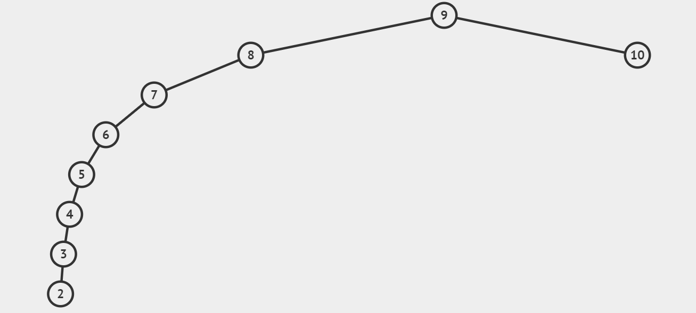

#### 问题

如何自平衡，什么时候左旋，什么时候右旋，插入或者删除破坏了树的平衡怎么破

#### 简单介绍

红黑树是一种自平衡的二叉查找树。除了符合二叉查找树的基本特性外，会附加一些特性，将任意结点的左右子树高度差控制在规定的范围内，达到平衡状态，具有下列的附加特性：

1：节点是红色或黑色

2：根是黑色

3：所有叶子都是黑色

4：每个红色节点必须有两个黑色的子节点（从每个叶子到根的所有路径上不能有两个连续的红色节点。）

5：从任一节点到其每个叶子的所有路径都包含相同数目的黑色节点。

从性质5可以推出：如果一个节点存在黑子节点，那么该节点肯定有两个子节点。

#### 二叉查找树（BST）

1.**左**子树上所有结点的值均**小于或等于**它的根结点的值。

2.**右**子树上所有结点的值均**大于或等于**它的根结点的值。

3.左、右子树也分别为二叉排序树。

二叉查找树查询值使用的是二分查找的思想，查找所需的最大次数等同于二叉查找树的高度。

插入结点的时候也是利用类似的，找到新节点的位置然后插入。

但是二叉查找树插入值的时候容易出现不平衡，在极端的情况下容易退化成链表，所以就需要红黑树了。

#### 特性、优势

#### 操作

红黑树总是通过旋转和变色达到自平衡

**左旋、右旋、变色**

旋转

插入

删除

#### 查找

1. 从根结点开始查找，把根结点设置为当前结点；
2. 若当前结点为空，返回 null；
3. 若当前结点不为空，用当前结点的 key 跟查找 key 作比较；
4. 若当前结点 key 等于查找 key，那么该 key 就是查找目标，返回当前结点；
5. 若当前结点 key 大于查找 key，把当前结点的左子结点设置为当前结点，重复步骤 2；
6. 若当前结点 key 小于查找 key，把当前结点的右子结点设置为当前结点，重复步骤 2；

最坏的时间复杂度是O(2lgN)

#### 插入

1：查找插入位置；2：插入之后保持自平衡。

寻找插入位置：

1. 从根结点开始查找；
2. 若根结点为空，那么插入结点作为根结点，结束。
3. 若根结点不为空，那么把根结点作为当前结点；
4. 若当前结点为 null，返回当前结点的父结点，结束。
5. 若当前结点 key 等于查找 key，那么该 key 所在结点就是插入结点，更新结点的值，结束。
6. 若当前结点 key 大于查找 key，把当前结点的左子结点设置为当前结点，重复步骤 4；
7. 若当前结点 key 小于查找 key，把当前结点的右子结点设置为当前结点，重复步骤 4；

那么插入节点的时候，结点是什么颜色呢？是**红色**

##### 插入情景

- 插入的树为空树

  直接把插入结点作为根节点即可，还需要把根节点设置成黑色的，因为性质限定了根节点是黑色

- 插入结点的值已经存在

- 插入结点的父节点为黑节点

- 插入结点的父节点为红结点

  - 叔叔结点存在并且为红节点
  - 叔叔节点不存在或者为黑节点，并且插入结点的父亲节点是祖父结点的左子节点
  - 叔叔节点不存在或者为黑节点，并且插入结点的父亲节点是祖父结点的右子节点

#### 删除

- 情景 1：若删除结点无子结点，直接删除
- 情景 2：若删除结点只有一个子结点，用子结点替换删除结点
- 情景 3：若删除结点有两个子结点，用后继结点（大于删除结点的最小结点）替换删除结点

https://segmentfault.com/a/1190000012728513