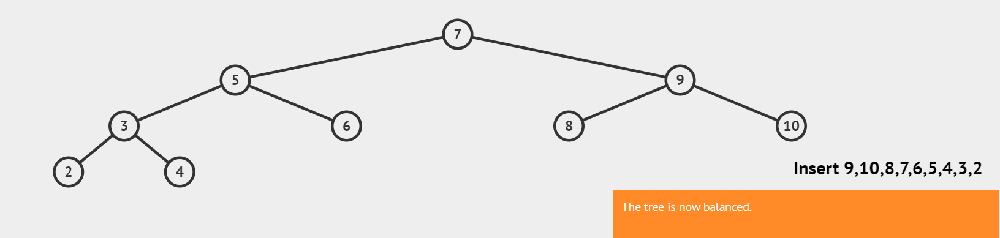

https://www.jianshu.com/p/e136ec79235c

#### 简单介绍

还是得先介绍二叉查找树

#### 二叉查找树（BST）

1.**左**子树上所有结点的值均**小于或等于**它的根结点的值。

2.**右**子树上所有结点的值均**大于或等于**它的根结点的值。

3.左、右子树也分别为二叉排序树。

二叉查找树查询值使用的是二分查找的思想，查找所需的最大次数等同于二叉查找树的高度。

插入结点的时候也是利用类似的，找到新节点的位置然后插入。

但是二叉查找树插入值的时候容易出现不平衡，在极端的情况下容易退化成链表，所以就需要红黑树了。

而上述的例子转换成AVL为

#### 定义

具有的性质：它是一 棵空树或它的左右两个子树的高度差的绝对值不超过1，并且左右两个子树都是一棵平衡二叉树。

#### 操作

旋转

**左旋，右子树右子节点**

**右旋，左子树左子节点**】

**先左旋再右旋，左子树右子节点**

**先右旋再左旋，右子树左子节点**

****

插入

删除